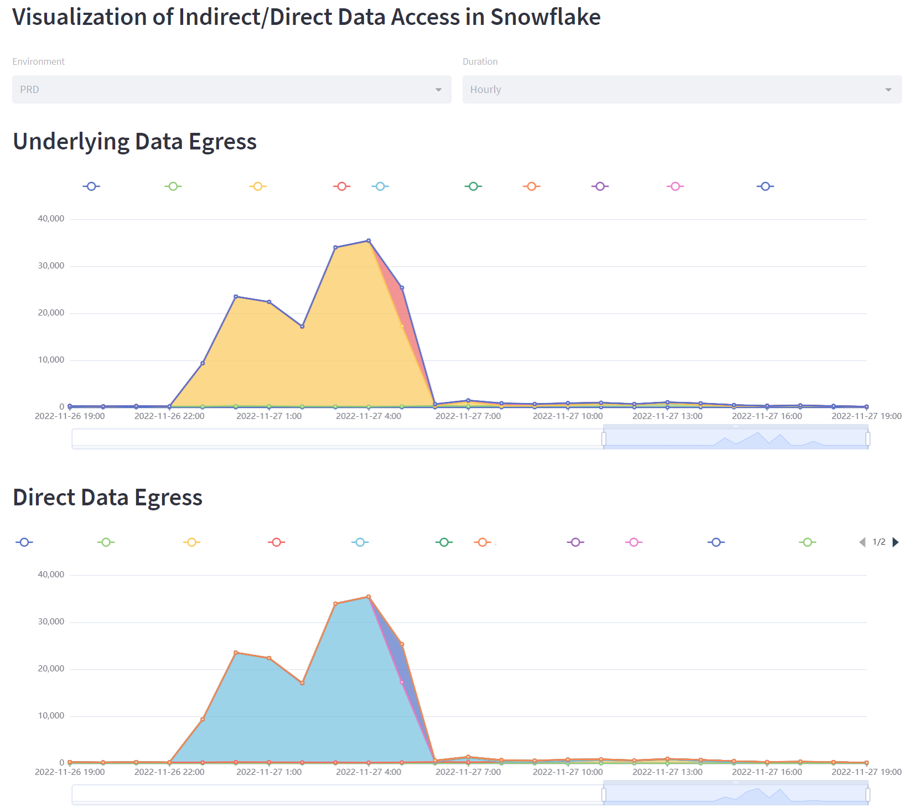
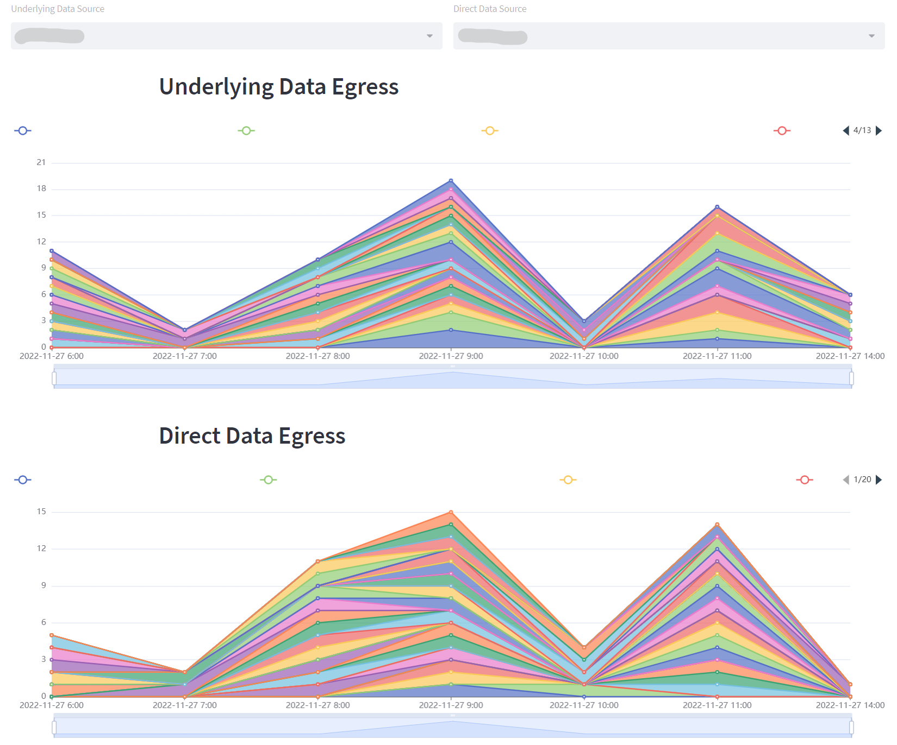

# streamlit-snowflake-access-history

Python &amp; Streamlit app to display ❄️ access_history data

# Pre-requisites

Snowflake Snowpark, streamlit, streamlit-echarts

Snowflake functions installed like the provided `myns` and `myenv` extracting your Snowflake namespace and environment. The sample code relies on your environment being formatted like 
NAMESPACE\_ENV\_..\_DB. 

# Configuration

At the top of the `access_history.py` script you will need to change the location of the 
functions for namespace/environments, as well as set all the Snowflake connection parameters.
I've decided to exclude the SYSTEM user from the access_history statistics. 

# Executing

Running the script after configuration is as simple as executing `streamlit run access_history.py`.

# Screenshots 

Top part of the Streamlit application showing `base_object_accessed` and `direct_object_accessed` data at the environment level:

Bottom part of the Streamlit application showing `base_objects_accessed` and `direct_object_accessed` data at the individual namespace level. 

# Author

Thomas Eibner (@thomaseibner) [twitter](http://twitter.com/thomaseibner) [LinkedIn](https://www.linkedin.com/in/thomaseibner/)

# Credits 

Nick Akincilar @ Snowflake for a LinkedIn [article](https://www.linkedin.com/feed/update/urn:li:activity:7001277956278906880/) highlighting the use of access_history

# License

Licensed under the Apache License, Version 2.0 (the "License"); you may not use this tool except in compliance with the License. You may obtain a copy of the License at: http://www.apache.org/licenses/LICENSE-2.0

Unless required by applicable law or agreed to in writing, software distributed under the License is distributed on an "AS IS" BASIS, WITHOUT WARRANTIES OR CONDITIONS OF ANY KIND, either express or implied. See the License for the specific language governing permissions and limitations under the License.
